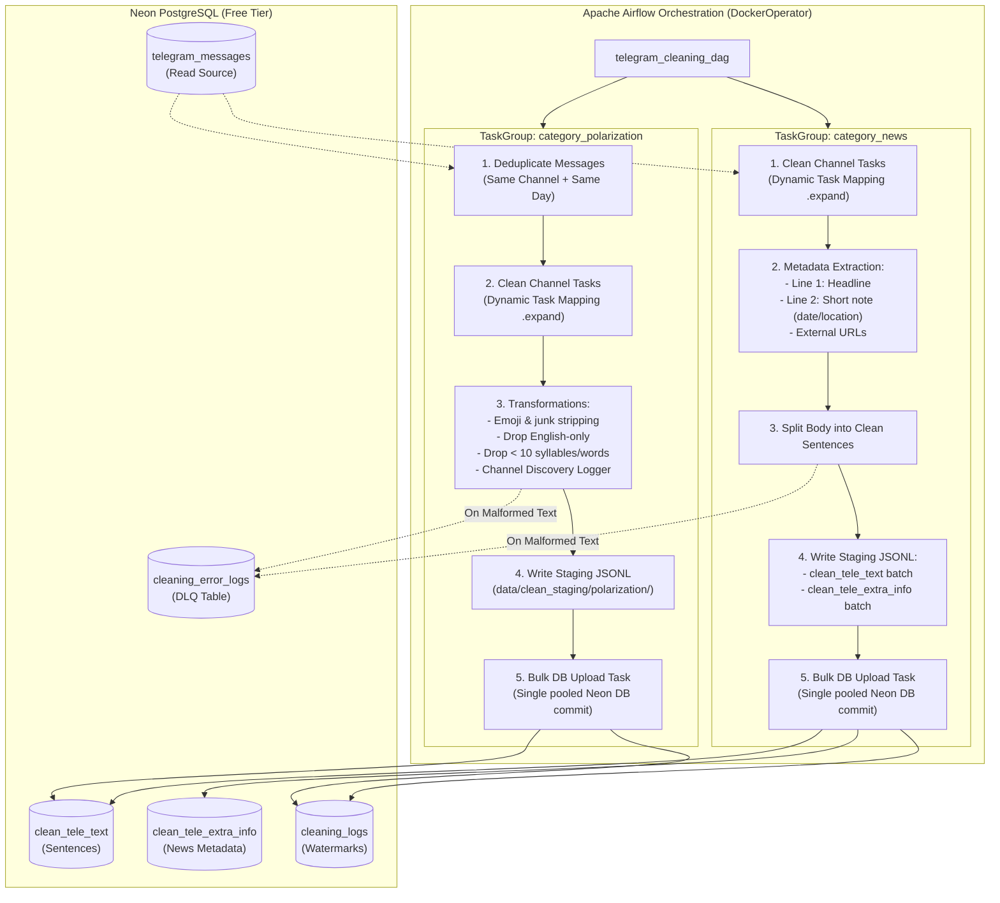
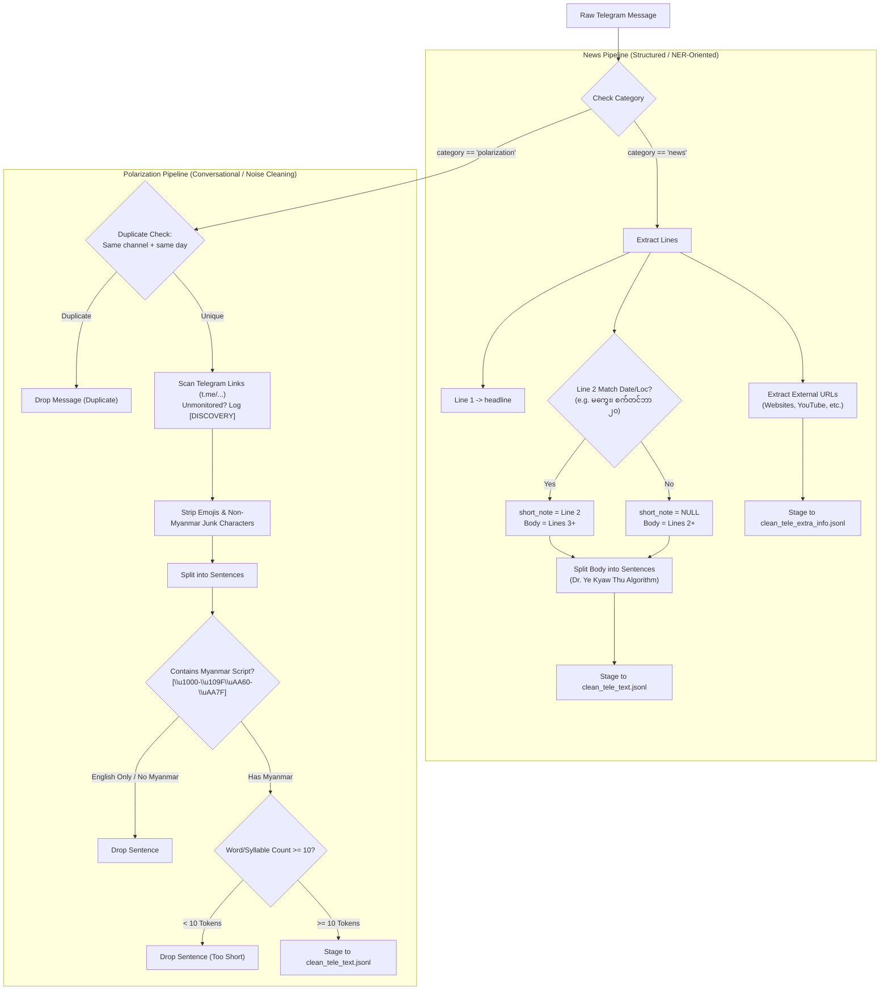

# Data Cleaning Concurrency & Lifecycle Architecture Specification

This document provides complete architectural specifications, operational constraints, database schemas, Airflow orchestration designs, advanced data transformation rules, and error recovery protocols for the Myanmar Text Cleaning pipeline (`services/telegram_scraper/cleaner.py`). It is structured as an authoritative technical specification for AI agents and data engineers implementing this workflow.

---

## 1. System Overview & Context

* **Target Service:** Myanmar Sentence Cleaner (`services/telegram_scraper/cleaner.py`).
* **Source Storage:** Neon PostgreSQL (`telegram_messages` table).
* **Destination Storage:** Neon PostgreSQL:
  * `clean_tele_text` (Cleaned sentence lines for annotation).
  * `clean_tele_extra_info` (Independent table for news headlines, location/date notes, and external URLs).
  * `cleaning_logs` (Per-channel per-day watermark audit trail).
  * `cleaning_error_logs` (Dead Letter Queue for malformed texts).
* **Orchestrator:** Apache Airflow with `DockerOperator` and Dynamic Task Mapping (`expand()`).
* **Intermediate Staging:** Local physical filesystem mounted into Docker containers (`PROJECT_DIR/data/clean_staging/`).
* **Cold Storage / Archival:** AWS S3 (future Parquet export for records older than 30 days).



---

## 2. Infrastructure Constraints & Database Protections

### 2.1 Neon PostgreSQL Constraints (Free Tier Protection)
* **Compute Units:** 100 CU-hours/month ceiling.
* **Connection Exhaustion Prevention:**
  * Free-tier PostgreSQL instances encounter timeouts and CPU spikes if tens of concurrent worker tasks connect simultaneously to insert small rows.
  * **Mitigation 1 (Category Staged Bulk Upload):** Channel-level cleaning tasks output intermediate JSONL files to a mounted physical staging volume. When all channels in a category complete, a single aggregation task executes bulk insertion (`bulk_insert_mappings`) over a single DB connection.
  * **Mitigation 2 (Airflow Concurrency Pools):** Read tasks from `telegram_messages` are throttled using an Airflow Pool (`neon_db_pool`, `slots=3` to `5`) to avoid query contention.
* **Storage Limit (0.5 GB):**
  * `CleanTeleText` produces multiple sentence rows per raw message, expanding row counts.
  * Active retention is restricted to a **30-day rolling window**. Data older than 30 days is archived to AWS S3.

---

## 3. Concurrency & Execution Architecture

### 3.1 Category & Channel Dynamic Task Mapping
* **Category Parallelism:** Categories (`polarization`, `news`) run in parallel TaskGroups.
* **Dynamic Channel Mapping:** Target channels are resolved from `config.yaml` and dynamically scheduled using Airflow Dynamic Task Mapping (`expand()`):
  ```python
  @task_group(group_id="clean_category_polarization")
  def polarization_group():
      channels = get_channels_for_category("polarization")
      # Dynamically map cleaning tasks across channels
      cleaned_staging_paths = clean_channel_task.expand(channel=channels)
      # Barrier task: bulk upload category files to Neon DB
      upload_category_task(cleaned_staging_paths, category="polarization")
  ```

### 3.2 Closed-Day Watermark Strategy (`--yesterday`)
* **Scheduled Execution:** The cleaning DAG executes daily after the scraping window for day $T-1$ closes (e.g. `08:00 UTC` daily).
* **Closed-Day Boundary:** Daily runs invoke the cleaner with `--yesterday` to process exclusively $T-1$ (`00:00:00` to `23:59:59` UTC).
* **Watermark Idempotency:**
  * Before processing, the task checks `cleaning_logs` for `status = 'completed'` matching `(channel_name, run_date)`.
  * If completed, the channel-day is skipped automatically.
  * Re-processing is only permitted when `--force` is explicitly passed (e.g. during manual backfills).

### 3.3 Dead Letter Queue (DLQ) & Fault Tolerance
* Text processing may encounter corrupted Unicode, regex timeout, or decoding anomalies.
* **In-Flight Error Isolation:**
  * If a message fails during sentence splitting or normalization, the error is caught and redirected to `cleaning_error_logs`.
  * The channel task continues processing subsequent messages without terminating the entire batch.
* **Manual Replay Mechanism:**
  * A dedicated CLI command (`python cleaner.py --retry-dlq`) allows operators to re-run failed messages once sanitization rules are updated.

---

## 4. Database Schema Specifications

All tables reside in the environment schema (`public` for `dev`, `production` for `prod`).

### 4.1 Schema Updates: `CleanTeleText` & `CleaningLog`
Both models are extended with the `category` column to maintain category partitioning and parity with `shared/scraper_models.py`.

```sql
-- 1. Extend clean_tele_text
ALTER TABLE clean_tele_text 
    ADD COLUMN IF NOT EXISTS category VARCHAR(50);
CREATE INDEX IF NOT EXISTS idx_clean_tele_category ON clean_tele_text(category);

-- 2. Extend cleaning_logs
ALTER TABLE cleaning_logs 
    ADD COLUMN IF NOT EXISTS category VARCHAR(50);
CREATE INDEX IF NOT EXISTS idx_cleaning_log_category ON cleaning_logs(category);
```

### 4.2 New Table: `clean_tele_extra_info` (News Metadata Table)
Stores external metadata (headline, short note, external URLs) separately from `clean_tele_text` for NLP NER annotation pipelines:

```sql
CREATE TABLE IF NOT EXISTS clean_tele_extra_info (
    id SERIAL PRIMARY KEY,
    channel_name VARCHAR(100) NOT NULL,
    category VARCHAR(50) NOT NULL,             -- e.g. 'news'
    message_id BIGINT NOT NULL,                -- Native Telegram message ID
    headline TEXT NULL,                        -- Extracted first line headline
    clean_info_date VARCHAR(100) NULL,         -- Standardized date in YYYY-MM-DD format (e.g. '2026-09-20'). Year is extracted from text or current scraping time.
    original_short_note VARCHAR(255) NULL,      -- Original Line 2 raw text (e.g. 'မကွေး၊ စက်တင်ဘာ ၂၀ ရက်')
    url_lists JSONB NULL,                      -- Array of external URLs (websites, YouTube, etc.)
    created_at TIMESTAMP WITH TIME ZONE DEFAULT NOW()
);

CREATE INDEX idx_extra_info_channel ON clean_tele_extra_info(channel_name);
CREATE INDEX idx_extra_info_msg_id ON clean_tele_extra_info(message_id);
CREATE INDEX idx_extra_info_category ON clean_tele_extra_info(category);
```

### 4.3 New Table: `cleaning_error_logs` (Cleaner DLQ)
```sql
CREATE TABLE IF NOT EXISTS cleaning_error_logs (
    id SERIAL PRIMARY KEY,
    category VARCHAR(50) NOT NULL,
    channel_name VARCHAR(100) NOT NULL,
    run_date VARCHAR(10) NOT NULL,              -- YYYY-MM-DD
    telegram_message_id INT NULL,               -- Logical reference to telegram_messages.id
    source_message_id BIGINT NULL,              -- Native Telegram message ID
    raw_text TEXT NULL,                         -- Original uncleaned text payload
    error_type VARCHAR(100) NOT NULL,           -- e.g. RegexTimeoutError, UnicodeDecodeError
    error_message TEXT NOT NULL,
    stack_trace TEXT NULL,
    retry_count INT DEFAULT 0,
    resolved BOOLEAN DEFAULT FALSE,
    created_at TIMESTAMP WITH TIME ZONE DEFAULT NOW(),
    resolved_at TIMESTAMP WITH TIME ZONE NULL
);

CREATE INDEX idx_cleaning_err_channel ON cleaning_error_logs(channel_name);
CREATE INDEX idx_cleaning_err_rundate ON cleaning_error_logs(run_date);
CREATE INDEX idx_cleaning_err_category ON cleaning_error_logs(category);
```

---

## 5. Advanced Category-Specific Data Transformation Pipeline

The data cleaning pipeline applies distinct transformation strategies based on the target category:



### 5.1 News Category Transformation Rules
News posts originate from official newsrooms and follow structured conventions:
1. **Headline Extraction & Dual Insertion:**
   * Line 1 is extracted as the article `headline`.
   * **Dual Storage:** Stored in `clean_tele_extra_info` as `headline` AND also appended to `clean_tele_text` as the first sentence (`line_index = 0`), since it constitutes complete, valid sentence text.
2. **Location & Date Note Extraction:**
   * Line 2 is checked against news dateline patterns (e.g. `မကွေး၊ စက်တင်ဘာ ၂၀`, `ရန်ကုန်၊ ဇူလိုင် ၁၀`).
   * If matched:
     * Line 2 is parsed into location and date components.
     * **Date Normalization:**
       * Myanmar digits (`၀-၉`) are converted to Western digits (`0-9`).
       * Myanmar month names are normalized via dictionary mapping:
         - `ဇန်နဝါရီ` -> January
         - `ဖေဖော်ဝါရီ` -> February
         - `မတ်` -> March
         - `ဧပြီ` -> April
         - `မေ` -> May
         - `ဇွန်` -> June
         - `ဇူလိုင်` -> July
         - `သြဂုတ်` / `ဩဂုတ်` -> August
         - `စက်တင်ဘာ` -> September
         - `အောက်တိုဘာ` -> October
         - `နိုဝင်ဘာ` -> November
         - `ဒီဇင်ဘာ` -> December
       * Standardized date is formatted in `YYYY-MM-DD` format (e.g. '2026-09-20') and stored in `clean_info_date`. Year is extracted from text, `run_date`, or current scraping time.
       * Original text will be stored in `original_short_note`.
     * Body text starts from Line 3.
   * If no match: `clean_info_date = None`, `original_short_note = None`, and body text starts from Line 2.
3. **External URL Extraction:**
   * Regex extracts all web URLs (`https?://[^\s]+`, YouTube links, website references).
   * Extracted URLs are compiled into a JSON array: `url_lists`.
4. **Output Destination:**
   * Metadata (`headline`, `clean_info_date`, `original_short_note`, `url_lists`, `channel_name`, `message_id`) is staged for bulk upload to `clean_tele_extra_info`.
   * Headline (`line_index = 0`) and body sentences (`line_index >= 1`) are split using the Dr. Ye Kyaw Thu algorithm and staged for bulk upload to `clean_tele_text`.

### 5.2 Polarization Category Transformation Rules
Polarization posts are conversational, informal, and prone to propaganda re-posts and noise:
1. **Intra-Channel Daily Deduplication:**
   * **Scope:** Deduplicate messages within the **same channel** and **same calendar day** (yesterday's window).
   * **Cross-Channel Rule:** If two *different* channels post identical content, **keep both** (cross-channel propagation is critical analytical signal).
   * **Execution:** Checked in-memory via text hash sets during channel iteration (or via dedicated deduplication step). Duplicates are skipped and logged in audit metrics.
2. **Telegram Channel Discovery:**
   * Scan text for channel entities (`t.me/<handle>`, `telegram.me/<handle>`, `@<handle>`).
   * Compare discovered handles against known channels in `config.yaml`.
   * If unmonitored: emit alert log:
     ```text
     [DISCOVERY] Found unmonitored Telegram channel '@<DISCOVERED_CHANNEL>' in channel '<CURRENT_CHANNEL>' (message_id: <ID>)
     ```
3. **Noise & Emoji Stripping:**
   * Remove unicode emoji ranges and non-linguistic noise characters while preserving valid Myanmar characters, standard Myanmar punctuation (`။`, `၊`), and essential alphanumeric context.
4. **English-Only Sentence Dropping:**
   * Check each sentence for the presence of Myanmar Unicode characters (`[\u1000-\u109F\uAA60-\uAA7F\uA9E0-\uA9FF]`).
   * If a sentence contains 0 Myanmar characters (e.g. purely English advertisements or link text), **drop it**.
5. **Short Sentence Filtering (< 10 Syllables/Words):**
   * Tokenize sentence by Myanmar syllable pattern (`(?:(?<![်္])([က-အ]|[\u1000-\u1021\u1023-\u102A\u1040-\u1049]))`) and whitespace.
   * If total token count is **< 8**, drop the sentence as incomplete text.

---

## 6. Staging & Upload Lifecycle (Docker Mount Protocol)

To honor the physical file-based staging requirement without causing Neon DB connection exhaustion:

### 6.1 Path Resolution & Docker Volume Mount
Airflow DAGs resolve the root project directory dynamically:
```python
AIRFLOW_HOME = Path(
    os.environ.get("AIRFLOW_HOME", Path(__file__).resolve().parent.parent / ".airflow")
)
PROJECT_DIR = AIRFLOW_HOME.parent
STAGING_DIR = PROJECT_DIR / "data" / "clean_staging"
```

In `DockerOperator`:
```python
Mount(
    source=str(STAGING_DIR),
    target="/app/data/clean_staging",
    type="bind",
)
```

### 6.2 Staging Directory Structure
```text
PROJECT_DIR/data/clean_staging/
├── polarization/
│   ├── channelA_2026-09-25_clean_tele_text.jsonl
│   └── channelB_2026-09-25_clean_tele_text.jsonl
└── news/
    ├── newsChannelA_2026-09-25_clean_tele_text.jsonl
    ├── newsChannelA_2026-09-25_clean_tele_extra_info.jsonl
    └── newsChannelB_2026-09-25_clean_tele_text.jsonl
```

### 6.3 Aggregated Bulk Upload Protocol
When all dynamic channel tasks finish:
1. `upload_category_task` iterates over `STAGING_DIR/<category>/*_<run_date>_*.jsonl`.
2. Connects to Neon PostgreSQL using a single pooled connection.
3. Executes `bulk_insert_mappings()` for `clean_tele_text` and `clean_tele_extra_info`.
4. Commits transaction and updates `cleaning_logs` to `status = 'completed'`.
5. Removes processed `.jsonl` files from `STAGING_DIR`.

---

## 7. Backfill and Archival Strategy

### 7.1 Backfill Operations
* **Manual Triggering:** Backfills are never scheduled automatically. Operators trigger backfills via CLI or manual Airflow run parameters (`conf={"from_date": "YYYY-MM-DD", "to_date": "YYYY-MM-DD", "force": true}`).
* **Force Re-Clean Safety Check:**
  > [!CAUTION]
  > Before executing `--force` on an existing date range, the cleaner must verify whether sentences in `clean_tele_text` have active associations in `annotation_results`.
  > Deleting annotated sentences triggers a cascade deletion of human work. The cleaner must preserve annotated rows or abort `--force` if annotations exist.

### 7.2 Archival Compatibility (30-Day Lifecycle)
* Data older than 30 days will be migrated to AWS S3 in Apache Parquet format:
  ```text
  s3://<S3_ARCHIVE_BUCKET_NAME>/<ENVIRONMENT>/<YEAR>/<MONTH>/<CATEGORY>/<CHANNEL_NAME>/clean_tele_text-archived-<YYYY-MM-DD>.parquet
  ```
* **Integrity Guard:** Clean text rows linked to `annotation_results` are either excluded from purge or archived alongside annotations.

---

## 8. Implementation Checklist for AI Agent

- [x] **1. Schema & Model Updates (`shared/annotation_models.py` & `services/nlp_annotation_app/models.py`):**
  - Add `category = Column(String(50), nullable=True, index=True)` to `CleanTeleText` and `CleaningLog`.
  - Create model `CleanTeleExtraInfo` (with `id, channel_name, category, message_id, headline, clean_info_date, original_short_note, url_lists, created_at`).
  - Create model `CleaningErrorLog` (DLQ table).
  - Mirror columns in `services/nlp_annotation_app/models.py` using `_col(...)`.
  - Update `init_annotation_db(...)` to create `clean_tele_extra_info`, `cleaning_error_logs`, and their indexes.
- [x] **2. Schema Migration Script (`services/telegram_scraper/migrate_cleaner_category.py`):**
  - Write idempotent migration script adding `category` column to `clean_tele_text` and `cleaning_logs`.
  - Create `clean_tele_extra_info` and `cleaning_error_logs` tables if not exist.
  - Implement backfill logic to populate `category` from `config.yaml` or `telegram_messages`.
- [x] **3. Advanced Transformation Logic (`services/telegram_scraper/cleaner.py`):**
  - **News Pipeline:**
    - Line 1 headline extraction (stored in both `clean_tele_extra_info` and `clean_tele_text` at `line_index=0`).
    - Line 2 location/date dateline detection (`clean_info_date`, `original_short_note`) with month dictionary and digit normalization.
    - URL extraction regex (websites, YouTube) into `url_lists`.
  - **Polarization Pipeline:**
    - Intra-channel same-day deduplication filter.
    - Telegram channel link discovery and `[DISCOVERY]` logging.
    - Emoji and non-linguistic noise stripping.
    - English-only sentence detection and drop filter.
    - Short sentence filter (< 8 syllables/words).
- [x] **4. Staging & Bulk Upload Engine:**
  - Add `--stage-dir` CLI parameter to write channel-day outputs to `.jsonl`.
  - Implement staging file writer for `clean_tele_text` and `clean_tele_extra_info`.
  - Add `--upload-staged` mode to ingest `.jsonl` files in a single Neon DB transaction and purge files.
  - Add `--retry-dlq` CLI option.
- [x] **5. Airflow DAG Creation (`services/telegram_scraper/airflow_dags/telegram_cleaning_dag.py`):**
  - Implement DAG with category TaskGroups for `polarization` and `news`.
  - Dynamic Task Mapping (`.expand()`) for channel-level cleaning with volume mount to `PROJECT_DIR/data/clean_staging`.
  - Aggregation task per category for bulk upload.
- [x] **6. Testing Suite (`tests/test_cleaning_concurrency.py`):**
  - Test News pipeline: headline, clean_info_date, original_short_note, and URL list extraction.
  - Test Polarization pipeline: deduplication, emoji removal, English-only drops, < 8 syllable drops, channel discovery logging.
  - Test staging `.jsonl` generation and subsequent bulk DB ingestion.
  - Test DLQ capturing on invalid data.
