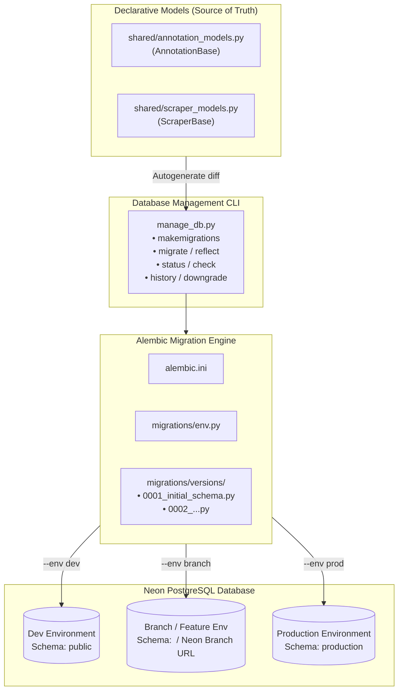

# Database Migration & Schema Management Guide

Unified schema migration architecture and operations guide for PostgreSQL (Neon) across Development, Branch, and Production environments using **Alembic** and [`manage_db.py`](file:///Users/thetpaing/Documents/Coding/test_ai_project/manage_db.py).

---

## 📌 Context: Why Models Didn't Update in Production

When modifying SQLAlchemy ORM models (e.g. adding columns, indexes, or constraints in [`shared/annotation_models.py`](file:///Users/thetpaing/Documents/Coding/test_ai_project/shared/annotation_models.py) or [`shared/scraper_models.py`](file:///Users/thetpaing/Documents/Coding/test_ai_project/shared/scraper_models.py)), SQLAlchemy's native `metadata.create_all()` **only creates non-existent tables**. It intentionally never alters existing tables, adds missing columns, or modifies schema structures.

Without an automated migration tool, production databases retain old table structures, leading to runtime failures and schema drift. To resolve this cleanly without ad-hoc custom SQL scripts, we integrated **Alembic**, the industry-standard database migration engine for SQLAlchemy, paired with the [`manage_db.py`](file:///Users/thetpaing/Documents/Coding/test_ai_project/manage_db.py) CLI.

---

## 🏗️ Migration Architecture & Flow



---

## 📋 Prerequisites & Configuration

Before running migration commands, ensure the Python virtual environment is activated and connection credentials are set:

```bash
source .venv/bin/activate
```

### Environment Variables (`.env`)

| Variable | Description | Example / Placeholder |
| :--- | :--- | :--- |
| `<NEON_DATABASE_URL>` | Primary database connection string | `postgresql://<DB_USER>:<DB_PASSWORD>@<DB_HOST>/<DB_NAME>?sslmode=require` |
| `<NEON_DATABASE_URL_DEV>` | (Optional) Dedicated dev database URL | `postgresql://<DB_USER>:<DB_PASSWORD>@<DEV_HOST>/<DB_NAME>?sslmode=require` |
| `<NEON_DATABASE_URL_PROD>` | (Optional) Dedicated prod database URL | `postgresql://<DB_USER>:<DB_PASSWORD>@<PROD_HOST>/<DB_NAME>?sslmode=require` |
| `<NEON_BRANCH_<NAME>_URL>`| (Optional) Dedicated Neon branch URL | `postgresql://<DB_USER>:<DB_PASSWORD>@<BRANCH_HOST>/<DB_NAME>?sslmode=require` |

---

## 🛠️ Step-by-Step Developer Workflow

### 1. Check Current Status & Detect Drift
Inspect whether your database schema is up-to-date with models:
```bash
source .venv/bin/activate && python manage_db.py status --env dev
```

### 2. Modify Models
Edit models in [`shared/annotation_models.py`](file:///Users/thetpaing/Documents/Coding/test_ai_project/shared/annotation_models.py) or [`shared/scraper_models.py`](file:///Users/thetpaing/Documents/Coding/test_ai_project/shared/scraper_models.py) (e.g., adding a new field or constraint).

### 3. Generate Migration File (`makemigrations`)
Autogenerate a version-controlled migration script comparing your models against the database:
```bash
source .venv/bin/activate && python manage_db.py makemigrations -m "add retry count to cleaning logs"
```
A new migration script will be created under `migrations/versions/`.

### 4. Review & Dry-Run
Preview the SQL statements that will be executed without modifying the database:
```bash
source .venv/bin/activate && python manage_db.py migrate --env dev --dry-run
```

### 5. Reflect Updates on Target Environment
Apply migrations to your target environment:

- **Development environment (default: `public` schema):**
  ```bash
  source .venv/bin/activate && python manage_db.py reflect --env dev
  ```

- **Feature Branch / Neon Branch:**
  ```bash
  source .venv/bin/activate && python manage_db.py reflect --env branch --branch feature-ner
  ```

- **Production environment (`production` schema):**
  ```bash
  source .venv/bin/activate && python manage_db.py reflect --env prod
  ```
  *(Note: Production requires interactive confirmation `[y/N]` or `-y` flag for automated pipelines)*

---

## 📖 CLI Commands Reference

| Command | Description | Example |
| :--- | :--- | :--- |
| `reflect` | Smart sync: stamps baseline if existing unversioned tables exist, then applies all pending migrations to head | `python manage_db.py reflect --env dev` |
| `migrate` | Apply migrations up to `--revision` (default: `head`) | `python manage_db.py migrate --env prod` |
| `makemigrations` | Autogenerate a new migration script from model changes | `python manage_db.py makemigrations -m "<message>"` |
| `status` | View active revision, repository head, and check for model drift | `python manage_db.py status --env dev` |
| `history` | List all historical migrations | `python manage_db.py history` |
| `downgrade` | Roll back database by N steps or to a specific revision | `python manage_db.py downgrade --steps 1 --env dev` |
| `stamp` | Stamp database with revision without executing DDL | `python manage_db.py stamp --revision head --env dev` |

---

## 🛡️ Foreign Key Relationships & Schema Safety

### Root Cause of `DependentObjectsStillExist`
When foreign key constraints exist on child tables (such as `annotation_results` and `skipped_records` pointing to `clean_tele_text.id`), PostgreSQL rejects dropping the parent table:
```text
cannot drop table production.clean_tele_text because other objects depend on it
DETAIL: constraint annotation_results_clean_line_id_fkey on table production.annotation_results depends on table production.clean_tele_text
```

### Long-Term Architectural Best Practices

1. **Alembic Drop Guardrail (`include_object`)**:
   In [`migrations/env.py`](file:///Users/thetpaing/Documents/Coding/test_ai_project/migrations/env.py), `include_object` is configured to prevent autogenerate from emitting accidental `DROP TABLE` commands when comparing multi-schema environments. PostgreSQL `search_path` is explicitly scoped per environment.

2. **Logical Foreign Keys for High-Throughput Pipelines (Recommended)**:
   Just as `CleanTeleText.telegram_message_id` is a logical reference to `TelegramMessage.id` without a database-level constraint (documented in [`shared/annotation_models.py`](file:///Users/thetpaing/Documents/Coding/test_ai_project/shared/annotation_models.py)), logical references eliminate locking, deadlocks, and migration ordering blocks during high-volume bulk ingestion.

3. **Explicit Cascading (`ondelete="CASCADE"`)**:
   Where database-level foreign key constraints are enforced, configure `ondelete="CASCADE"` so parent updates or purges automatically propagate without dependency rejection.

