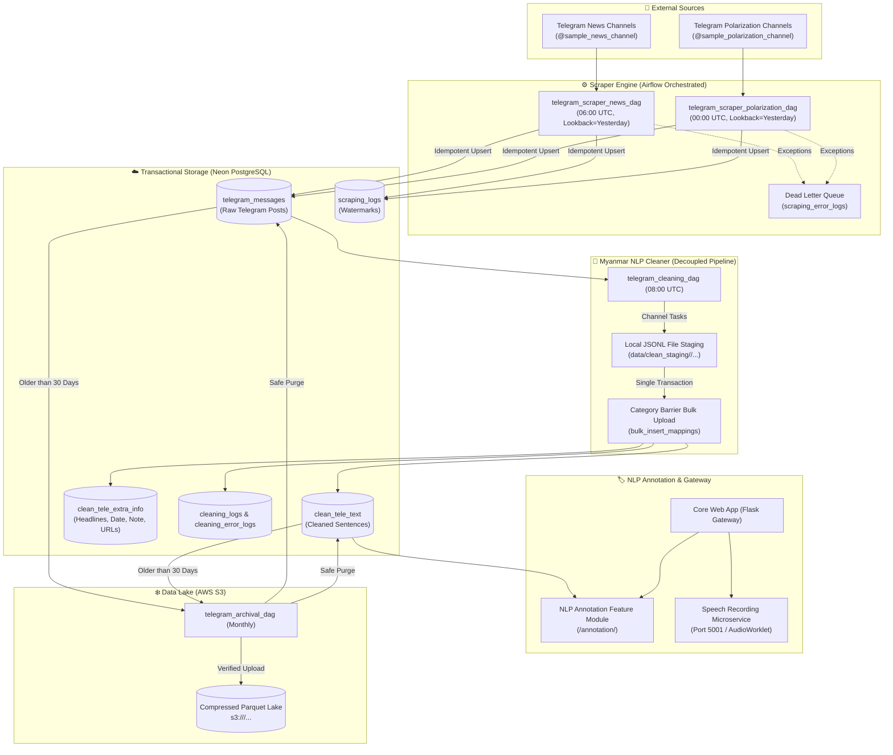

# Project Overview & Architecture Decisions

This document details the overall architectural vision, infrastructure choices, data pipelines, concurrency designs, and system integration strategies for the Telegram Scraping, Myanmar NLP Cleaning, and Annotation Platform.

---

## 📋 Prerequisites

To run and develop across the platform services, ensure the following prerequisites are met:
- **Python Environment:** Python 3.10+ managed via `.venv` (`source .venv/bin/activate`).
- **Database:** Neon Serverless PostgreSQL with `public` (dev) and `production` (prod) schemas.
- **Object Storage:** AWS S3 bucket (`<S3_ARCHIVE_BUCKET>`) with `ap-southeast-1` region for Parquet cold archival.
- **Container Environment:** Docker Engine 24.0+ and Apache Airflow 2.8+.
- **Authentication Credentials:**
  - `<TELEGRAM_API_ID>` & `<TELEGRAM_API_HASH>`: Telegram developer application keys.
  - `<TELEGRAM_STRING_SESSION>`: Telethon string session.
  - `<NEON_DATABASE_URL>`: Connection string formatted as `postgresql://<DB_USER>:<DB_PASSWORD>@<DB_HOST>/<DB_NAME>?sslmode=require`.

---

## 📍 System Architecture & End-to-End Pipeline Flow

The platform is designed as an end-to-end data acquisition, transformation, and linguistic labeling ecosystem:

---

## 🛠️ Key Architectural Decisions & Rationale

### 1. Database Architecture & Neon Free Tier Protection
- **Why Staggered Pipelines & File Staging?**
  - Neon PostgreSQL Free Tier enforces limits of **100 Compute Unit (CU) hours** and **0.5 GB storage**.
  - Writing directly from multiple concurrent channel tasks opens concurrent write connections and exhausts compute quotas.
  - **Solution:** Channel cleaning workers write intermediate records to disk (`data/clean_staging/<category>/...jsonl`). A single aggregation task performs a chunked bulk upload (`bulk_insert_mappings`) in one transaction, closing the connection immediately.

- **Why Automated Parquet Archival & Safe Purge?**
  - Active tables only retain the most recent **30 days** of data.
  - Older records are compressed with Snappy/Zstandard into Apache Parquet format and streamed to AWS S3.
  - **Annotation Cascade Protection:** When purging `clean_tele_text`, rows with associated human annotations in `annotation_results` are strictly excluded from deletion (`id NOT IN (SELECT clean_line_id FROM annotation_results)`).

### 2. Scraper Concurrency & Rate Limiting
- **Category Partitioning:** Channels are partitioned into `polarization` and `news`. Their execution schedules are staggered by 6 hours (`00:00 UTC` and `06:00 UTC`) to avoid hitting Telegram's rolling 24-hour limit (>200 distinct channels triggers soft bans).
- **Concurrency Control:** Channels within a run are processed with an in-memory `asyncio.Semaphore(5)` throttled over a persistent Telethon `StringSession`.
- **Closed-Day Batching (`--yesterday`):** Daily batch jobs scrape exclusively for $T-1$ (`00:00:00` to `23:59:59` UTC), ensuring 100% complete data without premature watermark closure.
- **Dead Letter Queue (`scraping_error_logs`):** Unrecoverable errors (e.g. banned channels, flood waits exceeding threshold) are captured to a DLQ table, preventing DAG failures while providing visibility for operational remediation.

### 3. Advanced Transformation & News Extraction
- **Decoupled News vs. Polarization Pipelines:**
  - **News Posts:** Official newsroom structure requires extracting Line 1 as `headline`, normalizing Line 2 datelines into strict `YYYY-MM-DD` date (`clean_info_date`) and preserving raw text in `original_short_note`, capturing web/video URLs into `url_lists`, and storing metadata in `clean_tele_extra_info`. Headlines are also appended to `clean_tele_text` (`line_index = 0`) to provide complete text for linguistic tagging.
  - **Polarization Posts:** Conversational posts undergo intra-channel same-day deduplication (SHA-256), emoji and noise stripping, English-only sentence removal, short-sentence dropping (< 8 syllables), and unmonitored Telegram channel discovery (`[DISCOVERY]` logging).

### 4. Microservice Decoupling (Speech Recording App)
- **Why Separate Microservice?**
  - Browser audio streaming requires `AudioWorklet` processing and high-frequency PCM chunk uploads.
  - Embedding audio capture directly inside the annotation platform creates memory contention.
  - **Solution:** `services/recording_app` operates as a standalone service with disk-backed atomic WAV finalization, bounded browser queues, and signed state verification.

---

## 🎯 System Milestones & Current State

1. **Phase 1: Workspace & Schema Initialization** `[COMPLETED]`
   - Established unified SQLAlchemy models in `shared/scraper_models.py` and `shared/annotation_models.py`.
   - Built idempotent migration CLI (`migrate_cleaner_category.py`).
2. **Phase 2: Scraper Bot & Concurrency Development** `[COMPLETED]`
   - Built category-partitioned scraper with async semaphore, `--yesterday` closed-day watermarking, and `scraping_error_logs` DLQ.
   - Deployed Airflow DAGs (`telegram_scraper_polarization_dag.py`, `telegram_scraper_news_dag.py`).
3. **Phase 3: Cleaner Concurrency & Advanced Transformation** `[COMPLETED]`
   - Decoupled `cleaner.py` with news dateline extraction (`YYYY-MM-DD`), dual headline storage, and polarization filters.
   - Staging directory engine (`--stage-dir`) and single-transaction bulk ingestion barrier (`--upload-staged`).
   - Implemented `telegram_cleaning_dag.py` running daily at `08:00 UTC`.
4. **Phase 4: Cold Storage Archival & Safe Purge** `[COMPLETED]`
   - Automated Parquet streaming to AWS S3 (`archival.py`).
   - Cascade-safe deletion preserving human annotations.
5. **Phase 5: Annotation Platform & Audio Recorder Integration** `[ACTIVE]`
   - Flask Annotation App supporting Sub-Tasks 1, 2, and 3.
   - Standalone Audio Recording App with atomic file finalization.
